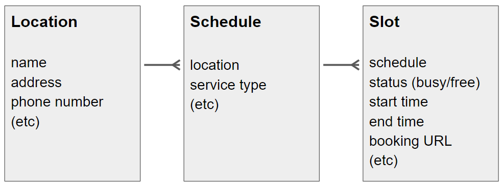

# Slot Publisher API

This guide explains how a _Slot Publisher_ makes vaccination or other appointment information available to a _Slot Discovery Client_.  **For background and role definitions, see [README.md](./README.md)**.

## Goals for Slot Discovery

* **Low implementation effort** -- publishers can expose available slots with nothing more than static web hosting (e.g., from a cloud storage bucket or off-the-shelf web server)
* **Scales up and down** -- publishers can expose information about a few vaccination sites and a few slots, or large-scale programs such as nationwide pharmacies or mass vaccination sites
* **Progressive enhancement** -- publishers can expose coarse-grained data like "we have 20 slots availaable today" or fine-grained data with specific timing for each slot
* **Build on standards** -- publishers expose data according to the FHIR standard, but don't need specific experience with FHIR to follow this guide

## Quick Start Guide

A _Slot Publisher_ hosts not only appointment slots, but also details about Locations and Schedules associated with these slots:


Concretely, a _Slot Publisher_ hosts four kinds of files:

* **Bulk Publication Manifest**. The manifest is a JSON file serving as the entry point for slot discovery. It provides links that clients can follow to retrieve all the other files. The manifest is always hosted at a URL that ends with `$bulk-publish` (a convention used when publishing static data sets using FHIR).
  * [Details on JSON structure](#manifest-file)
  * [Example file](https://raw.githubusercontent.com/smart-on-fhir/smart-scheduling-links/master/examples/$bulk-publish) showing a manifest for the fictional "SMART Vaccine Clinic", a regional chain with ten locations in Massachusetts. 
* **Location Files**.  Each line contains a minified JSON object representing a physical location where appointments are available.
  * [Details on JSON structure](#location-file)
  * [Example file](https://raw.githubusercontent.com/smart-on-fhir/smart-scheduling-links/master/examples/locations.ndjson) showing ten locations for the fictional "SMART Vaccine Clinic". Each line provides details about a single physical location in the MA area.
* **Schedule Files**.  Each line contains a minified JSON object representing the calendar for a healthcare service offered at a specific location.
  * [Details on JSON structure](#schedule-file)
  * [Example file](https://raw.githubusercontent.com/smart-on-fhir/smart-scheduling-links/master/examples/schedules.ndjson) showing ten locations for the fictional "SMART Vaccine Clinic". Since SMART Vaccine Clinics are offer only COVID-19 services, there is a single Schedule (the COVID-19 vaccination schedule) for each location. Each line provides details about a single schedule.
* **Slot Files**.  Each line contains a minified JSON object representing an appointment slot (busy or free) for a healthcare service at a specific location.
  * [Details on JSON structure](#slot-file)
  * [Example file](https://raw.githubusercontent.com/smart-on-fhir/smart-scheduling-links/master/examples/slots-2021-W09.ndjson) showing coarse-grained slots for a single week, across all ten "SMART Vaccine Clinic" sites. (_Note: The choice to break down slots into weekly files is arbitrary; the fictional Clinic could instead choose to host a single slot file, or produce location-specific files, or even group slots randomly._) Each of the published slots in this example includes a "capacity" extension indicating that the slot has a capacity of 100 patients; furthermore the slots include only coarse-grained timing (indicating they fall sometime beetween 9a and 6p ET, the clinic's fictional hours of operation). Ideally, Slot Publishers should provide finer-grained slot information with specific timing (see "progressive enhancement" in [Goals](#goals-for-slot-discovery) above), but coarse-grained slots provide an easy way to get started.

A client queries the manifest on a regular basis, e.g. once every 1-5 minutes. The client iterates through the links in the manifest file to retrieve any Location, Schedule, or Slot files it is interested in. 

### Performance Considerations

* _Slot Publishers_ MAY choose to host a separate manifest file for each state or geographical region where they operate, if they want to make data independently available for clients with limited regions of interest.
* Clients MAY include standard HTTP headers such as `If-None-Match` or `If-Modified-Since` with each query to prevent retrieving data when nothing has changed since the last query.
* Clients MAY include a `?_since={}` query parameter with an ISO8601 timestamp when retrieving a manifest file to request only changes since a particular point in time. Servers are free to ignore this parameter, meaning that clients should be prepared to retrieve a full data set.

## Manifest File

The manifest file is the entry point for a client to retrieve scheduling data. The manifest JSON file includes:

* `transactionTime`: string conveying ISO8601 timestamp with the time when this data set was published
* `request`: string conveying the full URL of the manifest
* `output`: array of JSON objects where:
  * `type`: string indicating whether this output item represents a `"Location"`, `"Schedule"`, or `"Slot"` file
  * `url`: string with the full URL of an NDJSON file for the specified type of data 

(For more information about this manifest file, see the [FHIR bulk data spec](http://build.fhir.org/ig/HL7/bulk-data/branches/bulk-publish/bulk-publish.html).)

### Example Manifest File

```js
{

  "transactionTime": "2021-01-01T00:00:00Z",
  "request": "https://example.com/covid-vaccines/$bulk-publish",
  "output": [
    {
      "type": "Schedule",
      "url": "https://example.com/data/schedule_file_1.ndjson"
    },
    {
      "type": "Location",
      "url": "https://example.com/data/location_file_1.ndjson"
    },
    {
      "type": "Slot",
      "url": "https://example.com/data/slot_file_MA.ndjson"
    },
    {
      "type": "Slot",
      "url": "https://example.com/data/slot_file_CT.ndjson"
    }
  ],
  "error": []
}
```

## Location File


Each line of the Location File is a minified JSON object that conveys a physical location where appointments are available.

Each Location includes at least:

* `resourceType`: string with a fixed value of `"Location"`
* `id`: string conveying a unique identifier for this location (up to 64 alphanumeric characters)
* `name`: string conveying the human-readable name of the location
* `telecom`: array of JSON objects, each conveying a phone number
  * `system`: string with a fixed value of `"phone"`
  * `value`: string with a full phone number
* `address`: JSON object conveying a USPS [complete address](https://pe.usps.com/text/pub28/28c2_001.htm)
  * `line`: array of strings conveying address lines
  * `city`: string
  * `state`: string
  * `postalCode`:  string
  * `district`: optional string conveying a county

Optionally a Location can include:

* `description`: string with additional information about this location (e.g., where to find it)
* `position`: JSON object conveying geocoordinates
  * `latitude`: number
  * `longitude`: number

### Example `Location`

```json
{
  "resourceType": "Location",
  "id": "123",
  "name": "Flynn's Pharmacy in Pittsfield, MA",
  "description": "Located behind old Berkshire Bank building",
  "telecom": [{
    "system": "phone",
    "value": "413-000-0000"
  }],
  "address": {
    "line": ["173 Elm St"],
    "city": "Pittsfield",
    "state": "MA",
    "postalCode": "01201-7223"
  }
}
```


### Example Location File
  * Example [file](https://raw.githubusercontent.com/smart-on-fhir/smart-scheduling-links/master/examples/locations.ndjson) 

## Schedule File

Each line of the Schedule File is a minified JSON object that conveys a information about a Schedule to which slots are attached. The Schedule represents a particular service (e.g., COVID-19 immunizations) offered at a specific location.

Each Schedule includes at least:

* `resourceType`: string with a fixed value of `"Schedule"`
* `id`: string conveying a unique identifier for this schedule (up to 64 alphanumeric characters)
* `actor`: array containing one JSON object with
  * `reference`: string conveying the location where appointments are available. Always formed as `Location` + `/` + the `id` value of an entry in a Location File (e.g., `Location/123`).
* `serviceType`: array of standardized concepts indicating what services are offered. For COVID-19 immunization Slots, the example resource below shows a `serviceType` that can be used verbatim. (This value uses two Codings, one to express the fact that the slot is for an immunization service, and another specific to COVID-19. This structure follows a convention in FHIR for expressing "codeable concepts" -- see [here](http://hl7.org/fhir/datatypes.html#codeableconcept) for details.)


### Example `Schedule`

```json
{
  "resourceType": "Schedule",
  "id": "456",
  "serviceType": [
    {
      "coding": [
        {
          "system": "http://terminology.hl7.org/CodeSystem/service-type",
          "code": "57",
          "display": "Immunization"
        },
        {
          "system": "http://fhir-registry.smarthealthit.org/CodeSystem/service-type",
          "code": "covid19-immunization",
          "display": "COVID-19 Immunization Appointment"
        }
      ]
    }
  ],
  "actor": [
    {
      "reference": "Location/123"
    }
  ]
}
```


### Example Schedule File
  * Example [file](https://raw.githubusercontent.com/smart-on-fhir/smart-scheduling-links/master/examples/schedules.ndjson) 


## `Slot` File

Each line of the Slot File is a minified JSON object that conveys information about an appointment slot. Publishers are encouraged to represent slots with fine-grained timing details (e.g.  representing appointments at specific times of the day), but MAY represent slots with coarse grained timing (e.g., "between 9 a.m. and 5 p.m." or "between noon and five p.m.").

Each `Slot` has:
* `resourceType`: string with a fixed value of `"Slot"`
* `id`: string conveying a unique identifier for this slot (up to 64 alphanumeric characters)
* `schedule`: JSON object indicating the Schedule this slot belongs to:
  * `reference`: string conveying the schedule for this slot. Always formed as `Schedule` + `/` + the `id` value of an entry in a Schedule File (e.g., `Schedule/123`).
* `status`: either `"free"` or `"busy"`. Publishers SHOULD include busy slots in addition to free slots to help clients monitor total capacity
* Timing for the slot. Together `start` and `end` SHOULD identify a narrow window of time for the appointment, but MAY be as broad as the clinic's operating hours for the day, if the publisher does not support fine-grained scheduling.
  * `start`: string conveying ISO8601 timestamp for the start time of this slot
  * `end`: string conveying ISO8601 timestamp for the end time of this slot
* `extension`: array of optional JSON objects for
  * "Booking" extension, used to convey a web link into the Provider Booking Portal (see [below](#deep-links-hosted-by-provider-booking-portal)) where the user can begin booking this slot.
     * `url`:  fixed value of `"http://fhir-registry.smarthealthit.org/StructureDefinition/booking-deep-link"`
     * `valueUrl`: string with is a deep link into the Provider Booking Portal
  *  "Capacity" extension, used to enable aggregated discovery at mass vaccination sites. Providers SHOULD advertise discrete slots, but MAY for performance or scalability reasons choose to aggregate otherwise identical slots (same schedule, status, start, and end times) with this extension.
     * `url`: fixed value of `"http://fhir-registry.smarthealthit.org/StructureDefinition/slot-capacity"`
     * `valueInteger` number indicating capacity (e.g., `"valueInteger": 300` to advertise a capacity of 300)

### Example `Slot`
```json
{
  "resourceType": "Slot",
  "id": "789",
  "schedule": {
    "reference": "Schedule/456"
  },
  "status": "free",
  "start": "2021-03-10T15:00:00-05",
  "end": "2021-03-10T15:20:00-05",
  "extension": [{
    "url": "http://fhir-registry.smarthealthit.org/StructureDefinition/booking-deep-link",
    "valueUrl": "https://ehr-portal.example.org/bookings?slot=opaque-slot-handle-89172489"
  }]
}
```

### Example Slot File
  * Example [file](https://raw.githubusercontent.com/smart-on-fhir/smart-scheduling-links/master/examples/slots-2021-W09.ndjson) 

## Deep Links hosted by _Provider Booking Portal_

The Booking Portal is responsible for handling incoming deep links.

Each Slot exposed by the _Slot Publisher_ includes an extension indicating the Booking Deep Link, a URL that the Slot Discovery Client can redirect a user to. The Slot Discovery Client can attach the following URL parameters to a Booking Deep Link:

* `source`: a correlation handle indicating the identity of the Slot Discovery Client, for use by the Provider Booking Portal in tracking the source of incoming referrals.
* `booking-referral`: a correlation handle for this specific booking referral. This parameter can optionally be retained by the Provider Booking Portal throughout the booking process, which can subsequently help the Slot Discovery Client to identify booked slots. (Details for this lookup are out of scope for this specification.)

### Example of deep linking into a booking portal

For the `Slot` example above, a client can construct the following URL to provide a deep link for a user to book a slot:

1. Parse the Booking Deep Link URL
2. Optionally append `source`
3. Optionally append`booking-referral`

In this case, if the `source` value is `source-abc` and the `booking-referral` is `34d1a803-cd6c-4420-9cf5-c5edcc533538`, then the fully constructed deep link URL would be:

    https://ehr-portal.example.org/bookings?slot=opaque-slot-handle-89172489&source=source-abc&booking-referral=34d1a803-cd6c-4420-9cf5-c5edcc533538

(Note: this construction is *not* as simple as just appending `&source=...` to the booking-deep-link, because the booking-deep-link may or may not already include URL parameters. The Slot Discovery Client must take care to parse the booking-deep-link and append parameters, e.g., including a `?` prefix if not already present.)
